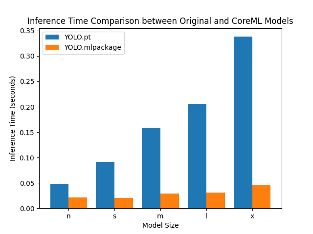

# YOLO CoreML Performance Benchmark

This project benchmarks the performance improvements of YOLO models when converted to CoreML format on Apple Silicon.

## Overview

The benchmark compares inference times between original PyTorch YOLO models and their CoreML counterparts across different model sizes (nano, small, medium, large, extra-large).

## Results

Result using Apple M1 Macbook Air 8GB RAM:



### Performance Data

| Model Size | Original (s) | CoreML (s) | Speed Improvement |
|------------|--------------|------------|-------------------|
| n (nano)   | 0.0529       | 0.0162     | 3.27x faster      |
| s (small)  | 0.0980       | 0.0166     | 5.90x faster      |
| m (medium) | 0.1707       | 0.0245     | 6.97x faster      |
| l (large)  | 0.2178       | 0.0471     | 4.63x faster      |
| x (xlarge) | 0.4083       | 0.0468     | 8.73x faster      |

## Key Findings

- **Average speed improvement**: 5.9x faster inference with CoreML
- **Best performance**: X-large model shows 8.73x improvement
- **Consistent gains**: All model sizes show significant performance improvements
- **Larger models benefit more**: Bigger models show greater relative speed improvements

## Usage

Run the benchmark with:
```bash
uv sync
uv run main.py
```

This will:
1. Load YOLO models in different sizes
2. Convert them to CoreML format (if not already done)
3. Run inference benchmarks
4. Generate performance comparison chart
5. Save detailed results to `benchmark_results.txt`

## Requirements

- Python 3.8+
- Ultralytics YOLO
- matplotlib
- Apple Silicon Mac (for CoreML acceleration)

## Notes

- Benchmark uses 10 warm-up runs per model for consistent measurements
- Test image: `bus.jpg` (must be present in working directory)
- CoreML models are saved as `.mlpackage` directories