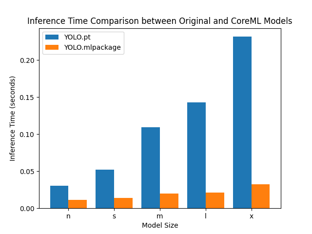

# YOLO CoreML Performance Benchmark

This project benchmarks the performance improvements of YOLO models when converted to CoreML format on Apple Silicon.

## Overview

The benchmark compares inference times between original PyTorch YOLO models and their CoreML counterparts across different model sizes (nano, small, medium, large, extra-large).

## Results

### Apple M1 MacBook Air (8GB RAM)


#### Performance Data

| Model Size | Original (s) | CoreML (s) | Speed Improvement |
|------------|--------------|------------|-------------------|
| n (nano)   | 0.0529       | 0.0162     | 3.27x faster      |
| s (small)  | 0.0980       | 0.0166     | 5.90x faster      |
| m (medium) | 0.1707       | 0.0245     | 6.97x faster      |
| l (large)  | 0.2178       | 0.0471     | 4.63x faster      |
| x (xlarge) | 0.4083       | 0.0468     | 8.73x faster      |

**M1 Key Findings:**
- **Average speed improvement**: 5.9x faster inference with CoreML
- **Best performance**: X-large model shows 8.73x improvement
- **Consistent gains**: All model sizes show significant performance improvements

### Apple M3 Ultra Mac Studio (96GB RAM)


#### Performance Data

| Model Size | Original (s) | CoreML (s) | Speed Improvement |
|------------|--------------|------------|-------------------|
| n (nano)   | 0.0263       | 0.0118     | 2.23x faster      |
| s (small)  | 0.0400       | 0.0130     | 3.08x faster      |
| m (medium) | 0.0614       | 0.0197     | 3.12x faster      |
| l (large)  | 0.0810       | 0.0210     | 3.86x faster      |
| x (xlarge) | 0.1186       | 0.0330     | 3.59x faster      |

**M3 Ultra Key Findings:**
- **Average speed improvement**: 3.18x faster inference with CoreML
- **Best performance**: Large model shows 3.86x improvement
- **Raw performance**: M3 Ultra is significantly faster overall, with even the slowest CoreML inference (0.033s) being faster than the fastest M1 CoreML inference (0.0162s for nano model)

### Apple M4 Mac Mini (16GB RAM)



#### Performance Data

| Model Size | Original (s) | CoreML (s) | Speed Improvement |
|------------|--------------|------------|-------------------|
| n (nano)   | 0.0305       | 0.0112     | 2.72x faster      |
| s (small)  | 0.0522       | 0.0142     | 3.68x faster      |
| m (medium) | 0.1092       | 0.0196     | 5.57x faster      |
| l (large)  | 0.1432       | 0.0213     | 6.72x faster      |
| x (xlarge) | 0.2316       | 0.0322     | 7.19x faster      |

**M4 Key Findings:**
- **Average speed improvement**: 5.18x faster inference with CoreML
- **Best performance**: X-large model shows 7.19x improvement
- **Consistent gains**: All model sizes show significant performance improvements
- **Balanced performance**: M4 combines good raw performance with strong relative improvements

### Cross-Generation Comparison

| Metric | M1 | M3 Ultra | M4 | Best Performance |
|--------|----|----------|----|------------------|
| Fastest CoreML inference | 0.0162s (n) | 0.0118s (n) | 0.0112s (n) | M4 |
| Slowest CoreML inference | 0.0468s (x) | 0.0330s (x) | 0.0322s (x) | M4 |
| Average speed improvement | 5.9x | 3.18x | 5.18x | M1 |
| Raw performance gain | baseline | ~1.4x faster | ~1.45x faster vs M1 | M4 |

## Key Findings

- **Significant performance gains**: All three generations (M1, M3 Ultra, M4) show substantial improvements with CoreML
- **M4 raw performance**: Fastest overall, with best times across all model sizes
- **M1 efficiency**: Highest relative speed improvements (5.9x average) due to slower baseline performance
- **M3 Ultra consistency**: Strong raw performance with moderate relative improvements (3.18x average)
- **M4 balance**: Excellent combination of raw speed and relative improvements (5.18x average)
- **Real-world impact**: M4 can run inference in as little as 0.0112s (nano) to 0.0322s (xlarge)

## Usage

Run the benchmark with:
```bash
uv sync
uv run main.py
```

This will:
1. Load YOLO models in different sizes
2. Convert them to CoreML format (if not already done)
3. Run inference benchmarks
4. Generate performance comparison chart
5. Save detailed results to `benchmark_results.txt`

## Requirements

- Python 3.8+
- Ultralytics YOLO
- matplotlib
- Apple Silicon Mac (for CoreML acceleration)

## Notes

- Benchmark uses 10 warm-up runs per model for consistent measurements
- Test image: `bus.jpg` (must be present in working directory)
- CoreML models are saved as `.mlpackage` directories